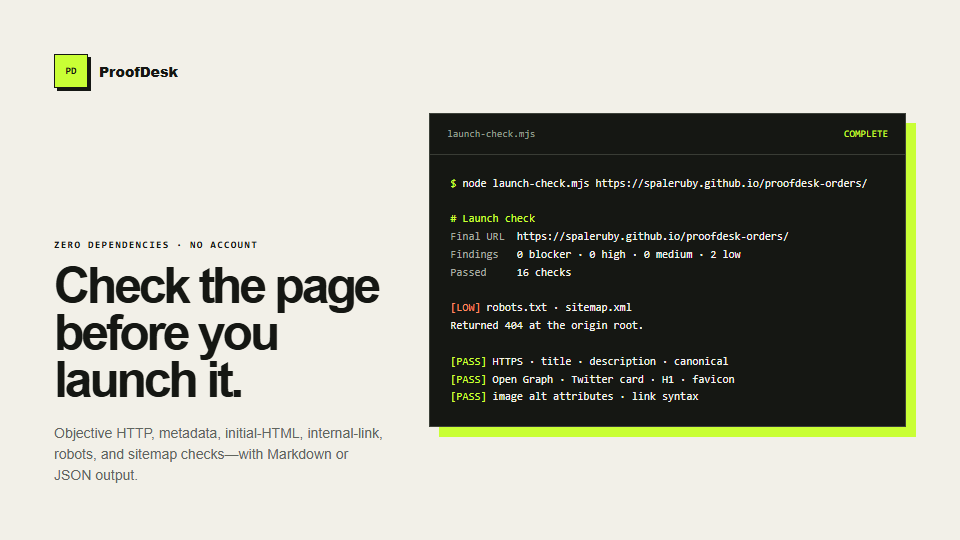

# ProofDesk Launch Check

A zero-dependency, evidence-first check for public launch pages. It catches objective problems before a Product Hunt, Show HN, directory, or customer launch without uploading the URL or report to a third-party dashboard.



## Use it as a GitHub Action

The Action uses GitHub's built-in Node.js runtime. It does not run `npm install`, require a checkout step, or load third-party packages.

```yaml
name: Launch readiness

on:
  workflow_dispatch:

permissions:
  contents: read

jobs:
  launch-check:
    runs-on: ubuntu-latest
    steps:
      - name: Check the public launch page
        id: launch
        uses: SpaleRuby/proofdesk-launch-check@v0.2.1
        with:
          url: https://example.com
          max-links: 20
          report-path: launch-report.md
          fail-on: high
```

The step writes the complete report to the GitHub Job Summary and to `launch-report.md`. It also exposes `result`, `blockers`, `high`, `medium`, `low`, `passed`, `final-url`, and `report-path` outputs.

| Input | Default | Purpose |
| --- | --- | --- |
| `url` | required | Public HTTP or HTTPS page to check |
| `max-links` | `20` | Same-origin links to request; use `0` to skip |
| `timeout-ms` | `10000` | Per-request timeout from 100 to 60000 ms |
| `report-path` | `launch-report.md` | Markdown report path in the workspace |
| `fail-on` | `high` | Fail on `blocker`, `high`, `medium`, `low`, or `never` |

## Use it from the command line

```bash
node launch-check.mjs https://example.com > launch-report.md
```

Download the single-file release if you do not want to clone the repository:

```bash
curl -LO https://github.com/SpaleRuby/proofdesk-launch-check/releases/latest/download/launch-check.mjs
node launch-check.mjs https://example.com
```

Requires Node.js 20 or newer. Nothing is installed and no account is required.

## What it checks

- reachability, redirects, HTTPS, status, and HTML content type
- title, description, language, viewport, primary heading, and initial HTML copy
- canonical, Open Graph, Twitter/X card, and favicon declarations
- missing image `alt` attributes and malformed links
- up to 20 same-origin links for broken responses
- `robots.txt` and `sitemap.xml`

Use `--json` for machine-readable output or `--max-links=0` to skip link requests:

```bash
node launch-check.mjs https://example.com --json --max-links=10
```

The process exits with code `2` when it finds a blocker or high-severity item, `1` for invalid input/tool failure, and `0` otherwise.

## Why this is deliberately small

Lighthouse, axe, browser-based accessibility testing, copy review, and real user testing solve different problems. This script does not pretend to replace them. It creates a fast, reproducible baseline from the server-returned page and labels its limitations in every Markdown report.

Automated findings can also be false positives. Verify each one before opening an issue or contacting a maintainer.

## Inspect the evidence standard

The broader ProofDesk launch-QA method has produced these public, value-first reports. They are not paid-client claims:

- [GitCharta: missing canonical and social metadata](https://github.com/ThierryRakotomanana/GitCharta/issues/41)
- [BeastLab Multi-LLM: Codex JSONL parser discards successful responses](https://github.com/beastlabai/multi-llm-plugin/issues/2)
- [HNewhere: URL normalization merges case-sensitive resources](https://github.com/twalichiewicz/HNewhere/issues/24)
- [Tokimeter: a weekly Codex limit is labeled as the 5-hour window](https://github.com/toshipepe/tokimeter/issues/20)

Each report contains reproduction evidence, impact, and a proposed correction.

## Run the tests

```bash
npm test
```

## Need the human-readable layer?

[ProofDesk](https://spaleruby.github.io/proofdesk-orders/) offers a $10 introductory launch review. Payment is due only if the preview contains at least three distinct, reproducible findings. The workflow is transparently AI-assisted, and the report is checked before delivery.

For agents and scripts, the [ProofDesk x402 API](https://github.com/SpaleRuby/proofdesk-audit-api) returns a deterministic JSON report for $0.04 USDC on Base or Solana. Its repository includes a free example response and OpenAPI 3.1 description; the stable production endpoint is independently discoverable on [x402scan](https://www.x402scan.com/server/426be034-f5a8-4054-828f-da023d3730ea).

## Responsible use

Check only public pages you are allowed to request. Keep link limits small, identify the tool through its user agent, verify automated findings before filing an issue, and never use them as pressure.

MIT licensed.
